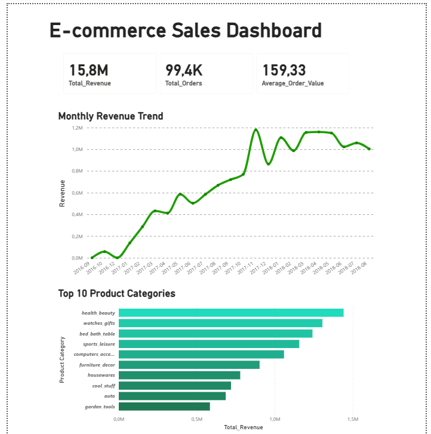
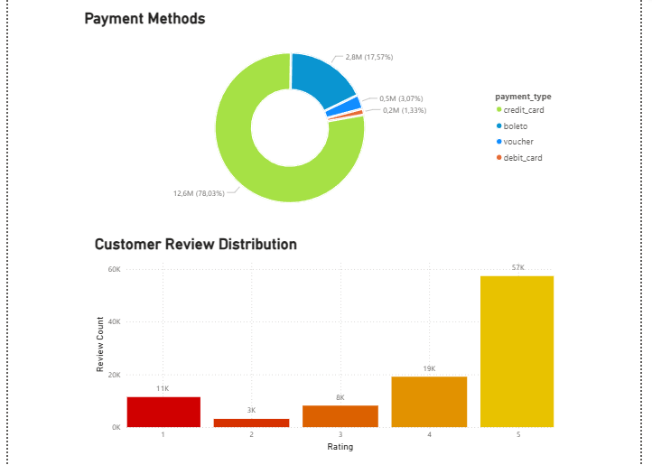
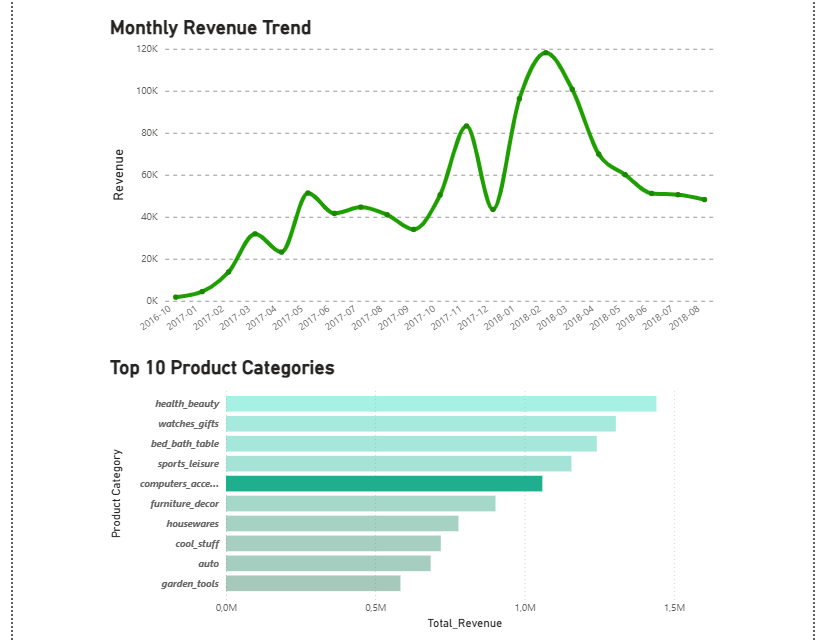
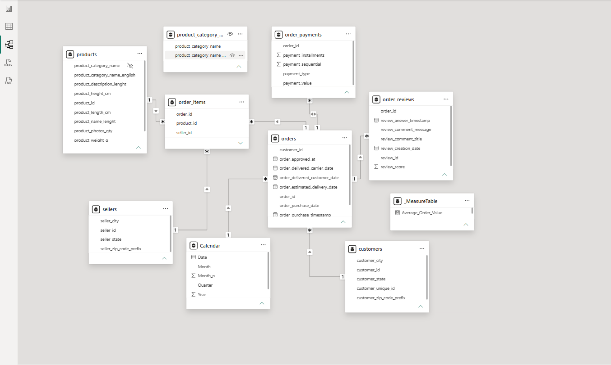
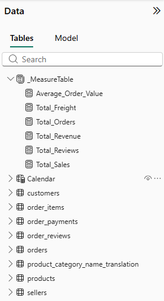

# Power BI: analiza e-commerce
Interaktywny dashboard analityczny w Power BI oparty na publicznym zbiorze danych pobranym z platformy Kaggle. Projekt obejmuje czyszczenie danych, modelowanie relacyjne oraz wizualizację danych.
Link do zbioru danych: https://www.kaggle.com/datasets/olistbr/brazilian-ecommerce?select=olist_order_payments_dataset.csv

Transformacja Danych:
* Oczyszczenie danych, wybranie kolumn i odpowiednia modyfikacja ich.
* Stworzenie niestandardowych kolumn, stworzenie tabeli kalendarza pozwalającej na zachowanie chronologii.

Trendy Wzrostowe: Analiza linii trendu wykazuje stabilny i dynamiczny wzrost przychodów z miesiąca na miesiąc w badanym okresie.
Struktura Finansowa: Karty kredytowe stanowią dominującą metodę płatności i odpowiadają za zdecydowaną większość przychodów platformy.
Satysfakcja: Klienci są głównie usatysfakcjonowani, oceny to głównie 5 gwiazdek co wskazuje na dobrze prowadzony model biznesowy.
